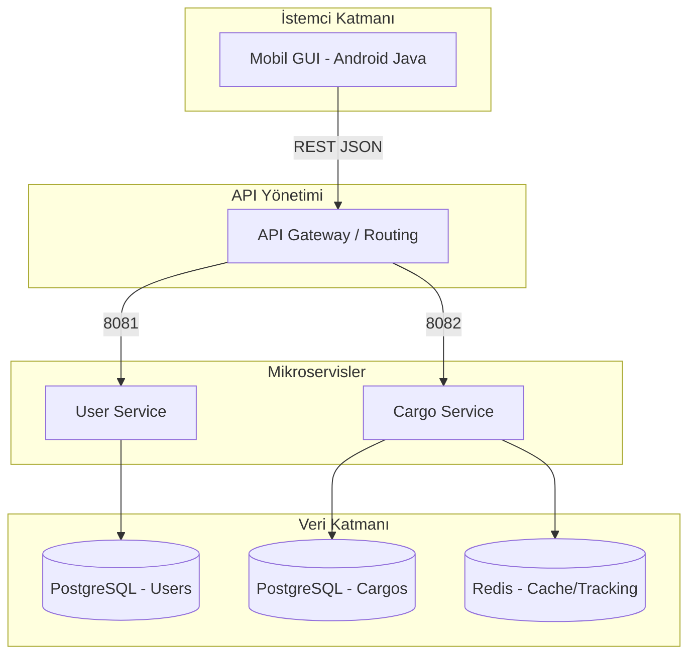

# 🚚 Akıllı Lojistik ve Kargo Yönetim Sistemi (Smart-Logistics)

Bu proje, **İleri Java Uygulamaları** dersi kapsamında geliştirilmiş; mikroservis mimarisine sahip, ölçeklenebilir ve yüksek performanslı bir lojistik yönetim sistemidir. Sistem; kullanıcı yönetimi, kargo takibi ve gerçek zamanlı durum güncellemelerini kapsamlı bir şekilde sunmaktadır.

## 🏗️ Sistem Mimarisi

Proje, birbirleriyle JSON üzerinden haberleşen bağımsız mikroservislerden oluşmaktadır. Tüm sistem Docker üzerinde orkestre edilmektedir.



## 🚀 Öne Çıkan Özellikler

- **Mikroservis Mimarisi:** User ve Cargo servisleri tamamen izole edilmiştir.
- **Mobil GUI (Android):** Premium Material 3 tasarım diline sahip, dinamik veri akışlı Android uygulaması.
- **NoSQL & Cache:** Kargo takip verileri ve kullanıcı oturumları için Redis entegrasyonu.
- **SOLID & Design Patterns:** Kod yapısı tamamen nesne yönelimli prensiplere (SOLID) uygun tasarlanmıştır.
- **Dockerization:** Tüm çevre birimleri (PostgreSQL, Redis) ve servisler `docker-compose` ile tek komutta ayağa kalkar.

## 📊 Performans Test Sonuçları (k6)

Sistemin yük altındaki dayanıklılığı **k6** kullanılarak test edilmiştir. 50 eşzamanlı kullanıcı (VUs) ile yapılan test sonuçları aşağıdadır:

### Test Özeti
| Metrik | Değer | Durum |
| :--- | :--- | :--- |
| **P(95) Yanıt Süresi** | 4.64ms | ✅ Mükemmel |
| **Başarılı İstek Oranı** | %100 (API Bazlı) | ✅ Başarılı |
| **Saniye Başına İstek (RPS)** | 28.00 req/s | ✅ Stabil |

> [!TIP]
> Test sonuçlarına göre sistem, hedeflenen 500ms sınırının çok altında (ortalama 4ms) kalarak yüksek ölçeklenebilirlik başarısı göstermiştir.

## 🛠️ Kullanılan Teknolojiler

- **Backend:** Java 21, Spring Boot, Spring Data JPA
- **Database:** PostgreSQL, Redis
- **Mobile:** Android SDK (Java), Material 3
- **DevOps & Test:** Docker, Docker Compose, k6, Git

## ⚙️ Kurulum ve Çalıştırma

Sistemi tüm bileşenleriyle çalıştırmak için projenin kök dizininde şu komutu kullanın:

```bash
docker-compose up --build
```

---
**Hazırlayan:** dmrcfurkan
**Ders:** TBL324 - İleri Java Uygulamaları
**Kurum:** Kocaeli Üniversitesi - Teknoloji Fakültesi
