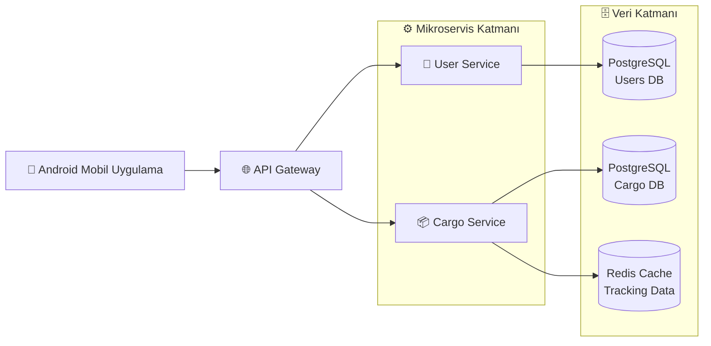
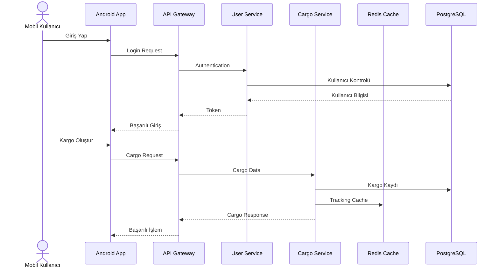
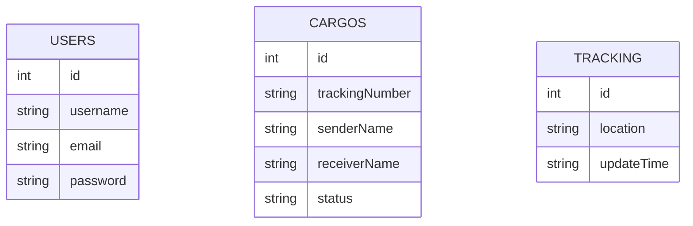
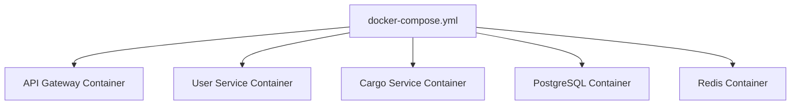
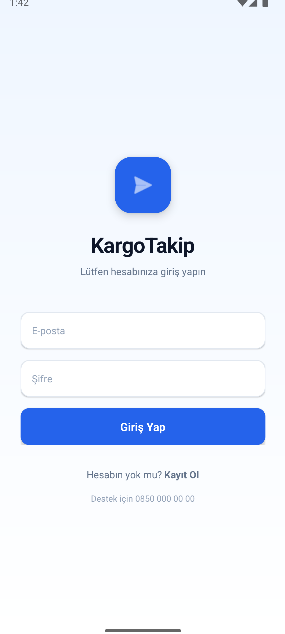
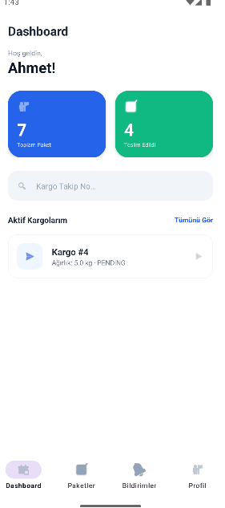
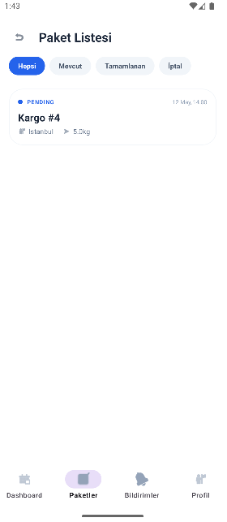

# 🚚 Akıllı Lojistik ve Kargo Yönetim Sistemi
## Smart Logistics & Cargo Management Platform

> Mikroservis mimarisi ile geliştirilmiş, ölçeklenebilir, yüksek performanslı ve gerçek zamanlı kargo yönetim sistemi.

---

# 👥 Proje Ekibi

| Ad Soyad | Öğrenci Numarası 
|---|---|
| Furkan Demirci | 231307061
| Fatih Bilgin | 231307019

---

# 📘 Proje Hakkında

Bu proje, **Kocaeli Üniversitesi Teknoloji Fakültesi** bünyesinde verilen **TBL324 - İleri Java Uygulamaları** dersi kapsamında geliştirilmiştir.

Sistem; kullanıcı yönetimi, kargo oluşturma, gönderi takibi, gerçek zamanlı durum güncellemeleri ve mobil erişim süreçlerini kapsayan modern bir lojistik otomasyon platformudur.

Proje mimarisi tamamen **mikroservis yaklaşımı** ile tasarlanmış olup servisler birbirinden bağımsız çalışacak şekilde geliştirilmiştir. Sistem, yüksek erişilebilirlik ve ölçeklenebilirlik hedeflenerek Docker ortamında çalıştırılmaktadır.

---

# 🎯 Proje Amaçları

- Mikroservis mimarisi kullanarak modüler yapı oluşturmak
- REST API tabanlı servis haberleşmesi sağlamak
- Android mobil istemci geliştirmek
- PostgreSQL ve Redis entegrasyonu gerçekleştirmek
- Docker ile konteyner tabanlı dağıtım yapmak
- k6 / JMeter ile performans testi uygulamak
- GitHub üzerinde teknik dokümantasyon ve Mermaid diyagramları kullanmak

---

# 🏗️ Sistem Mimarisi



---

# 🔄 Mikroservis İletişim Yapısı



---

# 🧩 Kullanılan Teknolojiler

| Katman | Teknoloji |
|---|---|
| Backend | Java 21, Spring Boot |
| Mobil | Android SDK (Java) |
| Database | PostgreSQL |
| Cache / NoSQL | Redis |
| API Haberleşme | RESTful JSON API |
| Containerization | Docker & Docker Compose |
| Versiyon Kontrol | Git & GitHub |
| Performans Testi | k6, JMeter |
| Mimari Yaklaşım | Mikroservis Mimarisi |
| Tasarım Prensipleri | SOLID, OOP |

---

# 📱 Mobil Uygulama Özellikleri

- Material Design 3 tabanlı modern arayüz
- Kullanıcı giriş sistemi
- Kargo oluşturma ekranları
- Gerçek zamanlı kargo takip sistemi
- Fragment tabanlı navigation yapısı
- REST API entegrasyonu
- Dinamik veri akışı

---

# ⚙️ Backend Özellikleri

- Mikroservis tabanlı yapı
- Bağımsız servis yönetimi
- API Gateway yönlendirmesi
- PostgreSQL veri yönetimi
- Redis cache desteği
- JSON tabanlı servis haberleşmesi
- Docker container desteği

---

# 🗄️ Veritabanı Yapısı



---

# 📊 Performans Testleri

Sistem performansı hem **k6** hem de **JMeter** araçları kullanılarak test edilmiştir.

## k6 Test Sonuçları

| Metrik | Sonuç |
|---|---|
| Virtual User (VUs) | 50 |
| Ortalama Yanıt Süresi | 4.64 ms |
| Başarı Oranı | %100 |
| İstek/Saniye (RPS) | 28 req/s |
| Maksimum Hedef Süre | 500 ms |
| Sonuç | ✅ Başarılı |

---

# 📈 Performans Değerlendirmesi

- Sistem yüksek eşzamanlı kullanıcı yükü altında stabil çalışmıştır.
- API yanıt süreleri hedeflenen limitlerin oldukça altında kalmıştır.
- Redis cache kullanımı sayesinde veri erişim performansı artırılmıştır.
- Mikroservis mimarisi sayesinde servisler bağımsız ölçeklenebilir yapıdadır.

---

# 🐳 Docker Yapısı

Tüm servisler Docker ortamında container mantığıyla çalıştırılmaktadır.



---

# 🚀 Kurulum ve Çalıştırma

## 1. Repository Klonlama

```bash
git clone https://github.com/Smart-Logistics-Management-System/Smart-Logistics-Management-System.git
```

## 2. Docker Ortamını Başlatma

```bash
docker-compose up --build
```

## 3. Servislerin Çalıştığını Kontrol Etme

| Servis | Port |
|---|---|
| API Gateway | 8080 |
| User Service | 8081 |
| Cargo Service | 8082 |
| PostgreSQL | 5432 |
| Redis | 6379 |

---

# 🧪 Test Araçları

## k6

```bash
k6 run performance-test.js
```

# 📸 Uygulama Görselleri

## Mobil Uygulama







# 📂 Proje Yapısı

```text
smart-logistics/
│
├── api-gateway/
├── user-service/
├── cargo-service/
├── mobile-app/
├── docker-compose.yml
├── performance-tests/
└── README.md
```

---

# 🔐 Yazılım Mühendisliği Yaklaşımları

- SOLID prensipleri uygulanmıştır
- Katmanlı mimari kullanılmıştır
- Servis bağımsızlığı sağlanmıştır
- Modüler kod yapısı geliştirilmiştir
- REST standartlarına uygun API tasarlanmıştır

---

# 📌 Sonuç

Bu proje ile modern yazılım geliştirme süreçlerinde kullanılan:

- Mikroservis mimarisi
- Docker container yapıları
- Mobil istemci geliştirme
- Performans testleri
- Cache sistemleri
- Teknik dokümantasyon süreçleri

başarıyla uygulanmıştır.

Sistem; yüksek performanslı, genişletilebilir ve sürdürülebilir bir lojistik platformu olarak tasarlanmıştır.

---

# 🎓 Ders Bilgileri

| Bilgi | Açıklama |
|---|---|
| Ders | TBL324 - İleri Java Uygulamaları |
| Üniversite | Kocaeli Üniversitesi |
| Fakülte | Teknoloji Fakültesi |
| Bölüm | Bilişim Sistemleri Mühendisliği |

---

