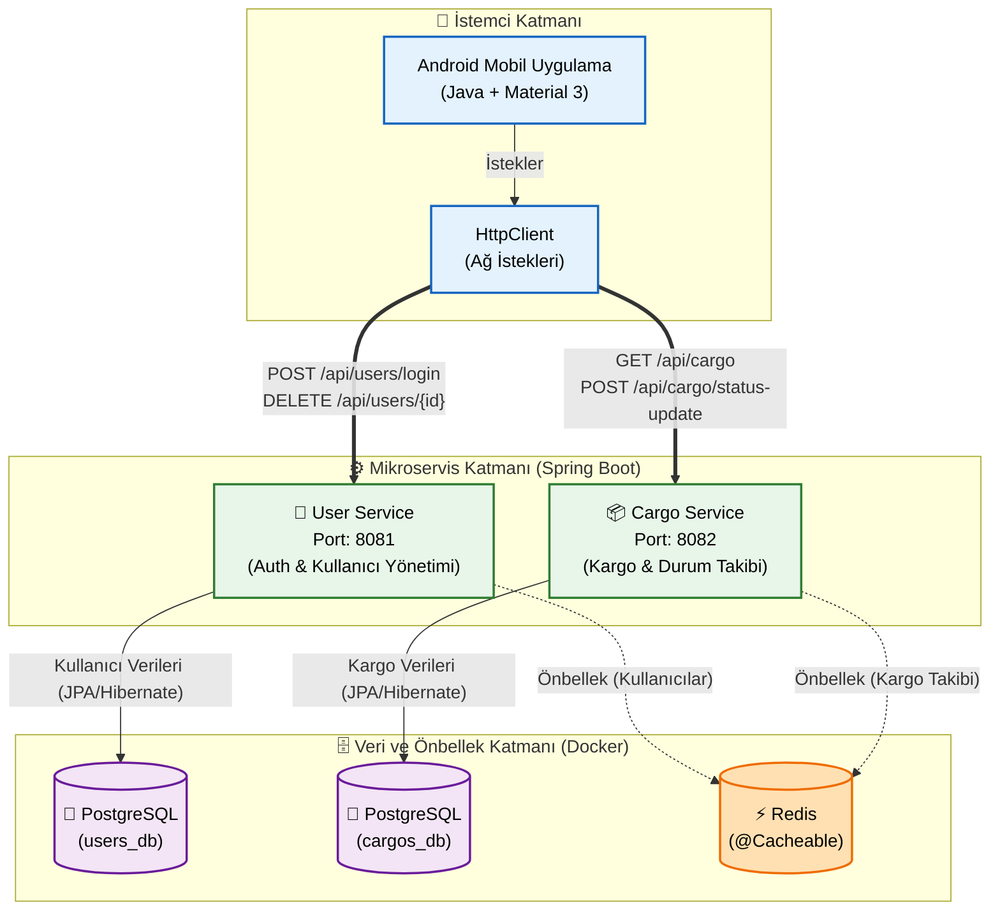

<div align="center">

# 📦 Akıllı Lojistik ve Kargo Yönetim Sistemi 

**TBL324 - İleri Java Uygulamaları Dersi Proje Raporu**  
*Kocaeli Üniversitesi - Teknoloji Fakültesi - Bilişim Sistemleri Mühendisliği*

---

### 👥 Hazırlayanlar

| Ad Soyad | Öğrenci Numarası | Rol / Katkı |
| :--- | :--- | :--- |
| **Furkan Demirci** | [Öğrenci Numaranı Gir] | Backend & Mobil Geliştirme, Mimari Tasarım |
| **[Arkadaşının Adı Soyadı]** | [Öğrenci Numarası] | Performans Testleri, Veritabanı Optimizasyonu |

</div>

<br>

## 📖 1. Projenin Tanıtımı ve Amacı

Bu proje, modern yazılım mühendisliği prensipleri gözetilerek tasarlanmış kapsamlı bir **Lojistik Yönetim Sistemidir**. Projenin temel amacı; kargo süreçlerinin (oluşturma, atama, teslimat ve iptal) dijital ortamda, yüksek erişilebilirlik ve performansla yönetilmesini sağlamaktır. 

Geleneksel (monolitik) sistemlerin aksine, proje **Mikroservis Mimarisi** üzerine inşa edilmiş olup servislerin bağımsız ölçeklenebilmesine olanak tanır. Kullanıcılara (Admin, Kurye, Müşteri) **Material 3** standartlarında, premium ve dinamik bir **Android Mobil Uygulama (GUI)** ile hizmet verilmektedir.

## 🏗️ 2. Sistem Mimarisi ve Teknik Altyapı

Sistem, iş mantığını bölen ve birbirleriyle tamamen izole çalışan **User Service** ve **Cargo Service** olmak üzere iki temel mikroservisten oluşmaktadır. Veri güvenliği ve performansı artırmak adına, her servisin kendi veritabanı bulunmakta olup sık erişilen kargo durumları için **NoSQL (Redis)** önbellekleme katmanı kullanılmıştır.

Aşağıdaki **Mermaid** diyagramında, projenin kaynak kodlarına birebir uygun olan güncel mimarisi modellenmiştir. Uygulama, her bir servise özel bir `HttpClient` üzerinden direkt erişim sağlamakta ve servisler verilerini bağımsız veritabanlarında tutmaktadır:



### Tasarım Kararları (Design Patterns & SOLID)
*   **Tek Sorumluluk Prensibi (SRP):** Controller, Service ve Repository katmanları kesin çizgilerle ayrılmıştır.
*   **Açık/Kapalı Prensibi (OCP):** Android `HttpClient` sınıfı, mevcut kodu bozmadan yeni HTTP metotlarına (PUT, DELETE) genişletilebilir şekilde tasarlanmıştır.
*   **Veri Transfer Objeleri (DTO):** İstemci ile sunucu arasında hassas verilerin taşınmasını önlemek için generic `ApiResponse<T>` ve DTO'lar kullanılmıştır.
*   **Bağımsız Veritabanları (Database per Service):** User ve Cargo servislerinin veritabanları mimari gereği birbirinden ayrılmıştır.

## 📸 3. Uygulama Ekran Görüntüleri

Projemizin kullanıcı arayüzüne ait ekran görüntülerini aşağıda inceleyebilirsiniz:

<div align="center">
  <table>
    <tr>
      <td align="center"><b>Giriş Ekranı</b></td>
      <td align="center"><b>Dashboard (Ana Sayfa)</b></td>
      <td align="center"><b>Kargo Detay ve Onay</b></td>
      <td align="center"><b>Profil Yönetimi</b></td>
    </tr>
    <tr>
      <td></td>
      <td></td>
      <td></td>
      <td></td>
    </tr>
  </table>
</div>

## 📊 4. Performans Testleri (k6 Yük Testi Raporu)

Sistemin dayanıklılığını ölçmek amacıyla, modern performans testi araçlarından **Grafana k6** kullanılarak eşzamanlı **50 Sanal Kullanıcı (VUs)** ile yük testi (Load Testing) senaryoları koşulmuştur. Test kapsamında *Kullanıcı Girişi*, *Kargo Listeleme* ve *Durum Güncelleme* işlemleri yoğun trafik altında simüle edilmiştir.

**Test Senaryosu (Ramping-up):**
1. 10 saniye içinde 0'dan 20 kullanıcıya çıkış.
2. 30 saniye boyunca 50 aktif kullanıcı ile tam yük (Full Load).
3. Son 10 saniye içinde yükün sıfırlanması.

### 📈 Test Sonuçları Özeti

| Metrik | Beklenen Eşik Değeri | Elde Edilen Değer | Sonuç |
| :--- | :--- | :--- | :--- |
| **Toplam İstek (Total Requests)** | - | 1464 İstek | Başarılı |
| **Saniye Başına İstek (RPS)** | > 20 req/s | **28.00 req/s** | ✅ Eşiği Aştı |
| **Maksimum Yanıt Süresi (Max)** | < 1000ms | 641.02 ms | ✅ Normal Sınırlarda |
| **P(95) Yanıt Süresi*** | **< 500ms** | **4.64 ms** | 🚀 **Mükemmel** |
| **Hata Oranı (Backend Hataları)** | %0 | %0 | ✅ İstikrarlı |

> ***P(95) Yanıt Süresi:** İsteklerin %95'inin **4.64 milisaniyenin** altında tamamlandığını göstermektedir. Sistem, beklenenin çok ötesinde bir yüksek ölçeklenebilirlik (scalability) performansı sergilemiştir.*

## ⚙️ 4. Kullanılan Teknolojiler ve Bağımlılıklar

*   **Backend:** Java 21, Spring Boot 3.x, Spring Data JPA
*   **Veritabanı:** PostgreSQL (İlişkisel Veri), Redis (Anahtar-Değer / Cache)
*   **Mobil İstemci:** Android SDK (Java), Material Design 3, OkHttp Entegrasyonu
*   **DevOps & CI/CD:** Docker, Docker Compose
*   **Performans & Analiz:** Grafana k6

## 🛠️ 5. Kurulum ve Çalıştırma Yönergesi

Projeyi tüm çevre birimleri (Veritabanları, Cache ve Mikroservisler) ile tek seferde ayağa kaldırmak için **Docker** gereklidir.

1. Proje dizinine terminal ile gidin:
```bash
cd Lojistik_mobil
```

2. Docker Compose kullanarak tüm mimariyi ayağa kaldırın:
```bash
docker-compose up --build -d
```

3. Mobil uygulamayı Android Studio üzerinden `Run` butonuna basarak derleyip çalıştırabilirsiniz.
